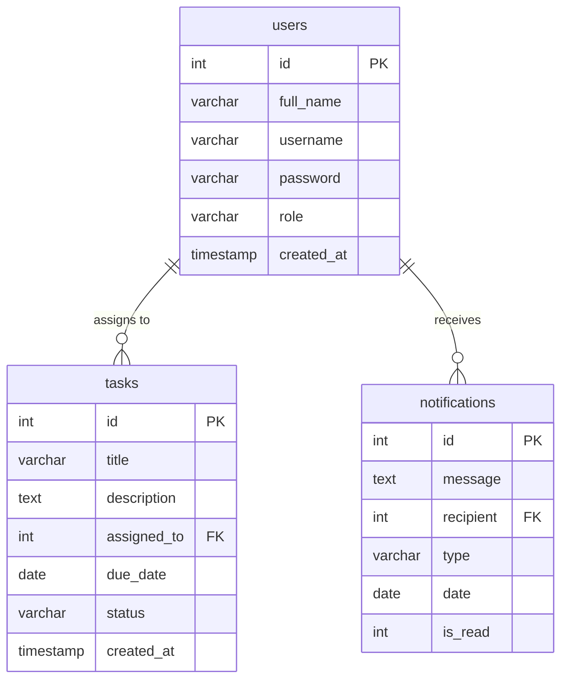

# 🗄️ KajTrack Database Schema & Dialect Portability

KajTrack uses a database-agnostic storage layer. It natively supports **MySQL / MariaDB** for production environments and automatically provisions a local **SQLite** database for zero-config local development sandboxes.

---

## ⚙️ Dialect Portability System

Our connection manager `/config/DB_connection.php` automatically abstracts the underlying driver. If a MySQL instance is not found, the system switches to SQLite and performs the following actions:
1. Provisions `database/task_management_db.sqlite` automatically.
2. Executes dynamic SQLite-compatible DDL statements to build tables.
3. Automatically seeds the tables with default employees, tasks, and notification feeds.
4. Substitutes dialect-specific queries with parameterized standard expressions.

---

## 📊 Database Schema Blueprint



### 👤 1. `users` Table
Stores authentication and authorization profiles.

| Column | Type (MySQL) | Type (SQLite) | Nullable | Default | Description |
| :--- | :--- | :--- | :--- | :--- | :--- |
| `id` | `INT` | `INTEGER` | No | *Auto-Increment* | Primary Key |
| `full_name` | `VARCHAR(50)` | `TEXT` | No | None | Employee's full name |
| `username` | `VARCHAR(50)` | `TEXT` | No | None | Unique login handle |
| `password` | `VARCHAR(255)` | `TEXT` | No | None | BCrypt hash of string `123` |
| `role` | `ENUM('admin','employee')` | `TEXT` | No | None | Role-Based Access controls |
| `created_at`| `TIMESTAMP` | `DATETIME` | Yes | `CURRENT_TIMESTAMP` | Account creation timestamp |

---

### 📋 2. `tasks` Table
Holds the metadata, workload info, and progress status of employee tasks.

| Column | Type (MySQL) | Type (SQLite) | Nullable | Default | Description |
| :--- | :--- | :--- | :--- | :--- | :--- |
| `id` | `INT` | `INTEGER` | No | *Auto-Increment* | Primary Key |
| `title` | `VARCHAR(100)` | `TEXT` | No | None | Name/Title of the assigned task |
| `description`| `TEXT` | `TEXT` | Yes | `NULL` | Task details |
| `assigned_to`| `INT` | `INTEGER` | Yes | `NULL` | Foreign Key references `users.id` |
| `due_date` | `DATE` | `DATE` | Yes | `NULL` | Deadline (format: `YYYY-MM-DD`) |
| `status` | `ENUM('pending','in_progress','completed')` | `TEXT` | No | `'pending'` | Lifecycle stage |
| `created_at`| `TIMESTAMP` | `DATETIME` | Yes | `CURRENT_TIMESTAMP` | Creation timestamp |

---

### 🔔 3. `notifications` Table
Stores events and task alerts pushed to employees.

| Column | Type (MySQL) | Type (SQLite) | Nullable | Default | Description |
| :--- | :--- | :--- | :--- | :--- | :--- |
| `id` | `INT` | `INTEGER` | No | *Auto-Increment* | Primary Key |
| `message` | `TEXT` | `TEXT` | No | None | Custom alert message text |
| `recipient` | `INT` | `INTEGER` | No | None | Foreign Key references `users.id` |
| `type` | `VARCHAR(50)` | `TEXT` | No | None | Trigger type classification |
| `date` | `DATE` | `DATE` | No | `CURRENT_TIMESTAMP`| Dispatch date |
| `is_read` | `TINYINT(1)` | `INTEGER` | Yes | `0` | Read flag (`0 = Unread`, `1 = Read`) |

---

## 🔐 Relational Integrity Constraints
- **Task Assignments**: `tasks.assigned_to` has a foreign key constraint linking to `users.id`.
- **System Cleanup**: Deleting an employee cascadingly updates assigned tasks to `NULL` to keep orphaned workloads safe.
- **Alert Map**: `notifications.recipient` matches `users.id`.

---

## ⚡ Database-Agnostic Querying Standards

To preserve cross-dialect compatibility, follow these formatting guidelines:

### 📅 1. Avoid Dialect-Specific Date Functions
- **Legacy Incompatibility**: MySQL's native `CURDATE()` throws a syntax error under SQLite.
- **Modern Solution**: Compute the standard date string inside PHP (`$today = date('Y-m-d')`) and pass it as a bound parameter:
  ```sql
  SELECT * FROM tasks WHERE due_date = :today;
  ```

### 🔢 2. Row Counting Methods
- **Legacy Incompatibility**: Calling `PDOStatement::rowCount()` on a `SELECT` query under SQLite returns `0`.
- **Modern Solution**: Fetch all rows into an array and measure the count using native PHP:
  ```php
  $stmt->execute();
  $rows = $stmt->fetchAll(PDO::FETCH_ASSOC);
  $count = count($rows);
  ```
