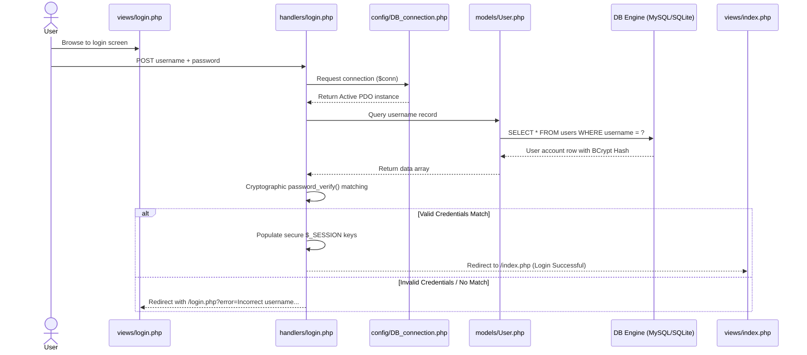
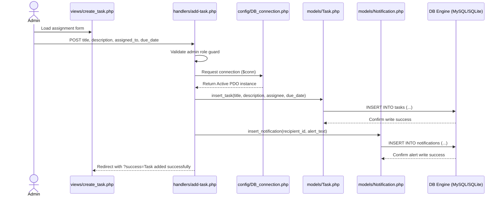
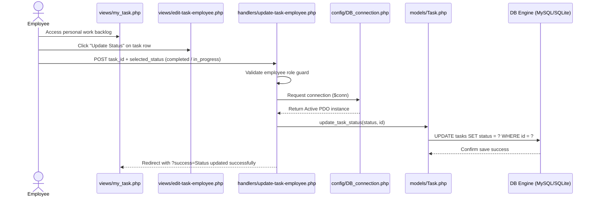
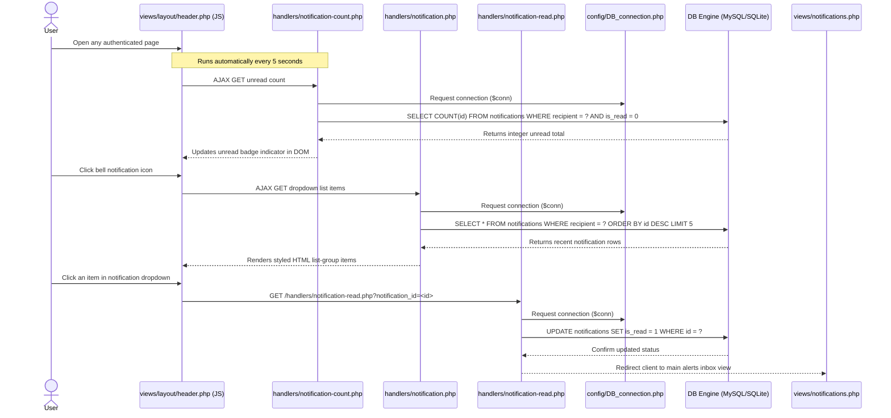

# 📊 KajTrack System Execution Flow Diagrams

This document contains Mermaid sequence diagrams that map the primary interaction loops, authorization guards, database drivers, and redirect parameters of the platform.

---

## 🔑 1. User Authentication & Login Flow

---

## 👑 2. Administrator Creates Task & Alerts Employee

---

## 👤 3. Employee Updates Task Progress Stage

---

## 🔔 4. Asynchronous Header Notifications Fetch

