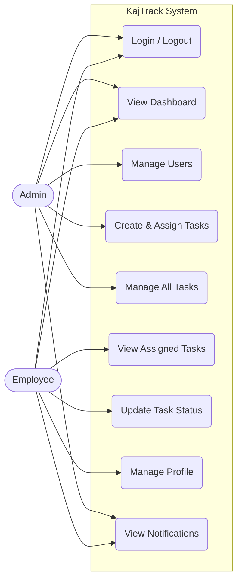

# Use Case Diagram

The Use Case Diagram provides a high-level visual representation of the KajTrack system, illustrating the interactions between the system's actors (Admin and Employee) and the various use cases (features) they can execute.

