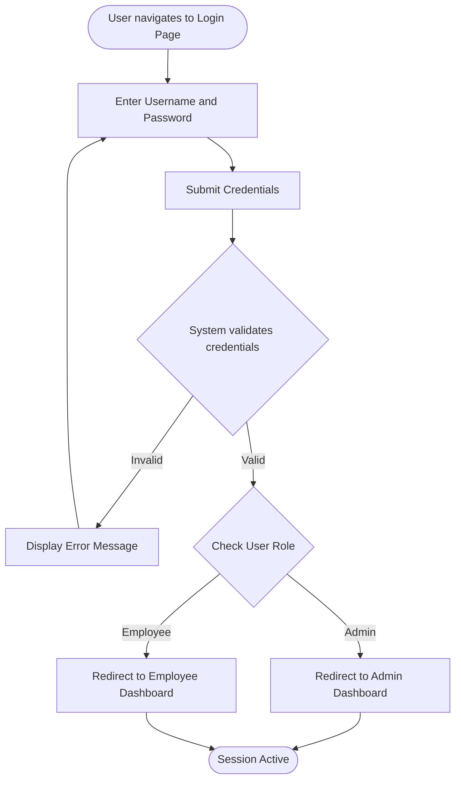
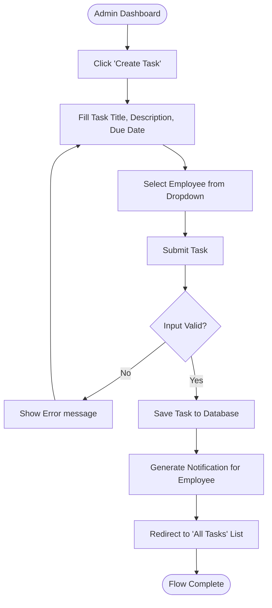
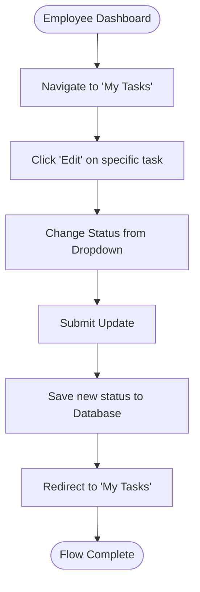

# Activity Diagrams

Activity diagrams map out the procedural flow of control from one activity to another within the KajTrack system.

## 1. Login Authentication Flow

## 2. Task Assignment Flow (Admin)

## 3. Update Task Status Flow (Employee)

