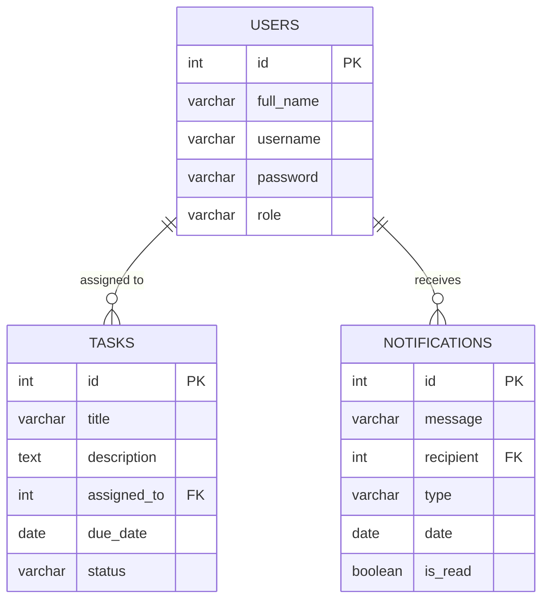

# Entity Relationship Diagram (ERD)

The ERD illustrates the core database tables in KajTrack and how they logically relate to one another.

### Relationship Details:
1. **USERS to TASKS (1:N)**: A single user (employee) can have many tasks assigned to them, but a task is currently assigned to only one user.
2. **USERS to NOTIFICATIONS (1:N)**: A single user can receive multiple notifications.
