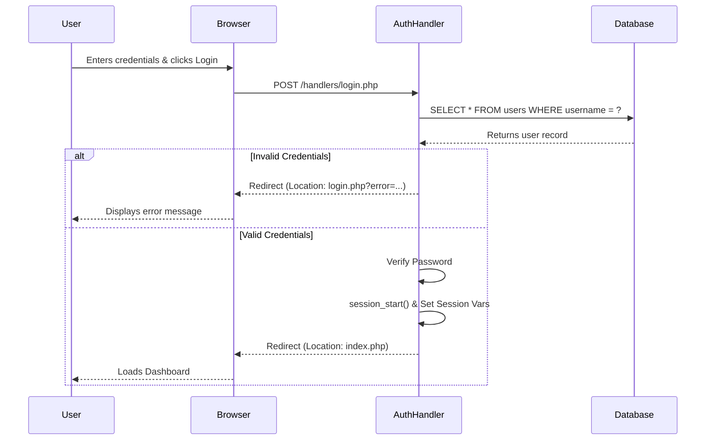
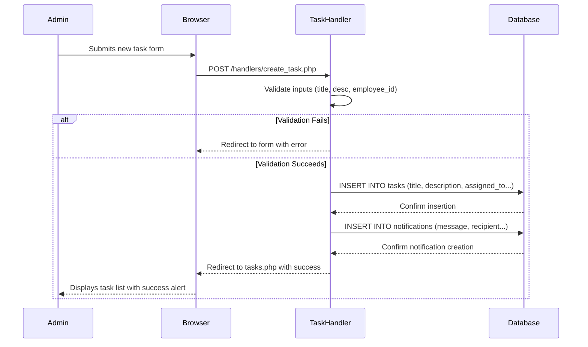

# Sequence Diagrams

Sequence diagrams represent the timeline of messages exchanged between the user, the frontend views, the backend handlers, and the database.

## 1. User Login Sequence

## 2. Admin Creates Task Sequence

