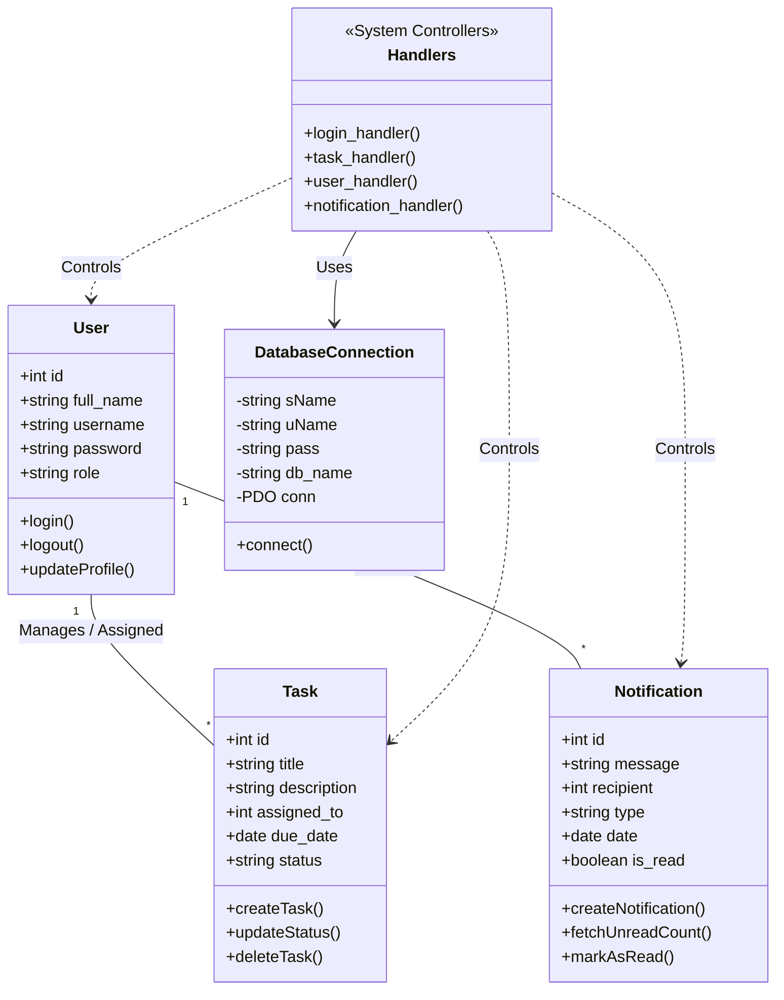

# Class Diagram / Domain Model

Since KajTrack is primarily built using a procedural PHP approach with handlers and views, this "Class Diagram" represents the Domain Entities and Logical Modules rather than strict Object-Oriented PHP classes. 

