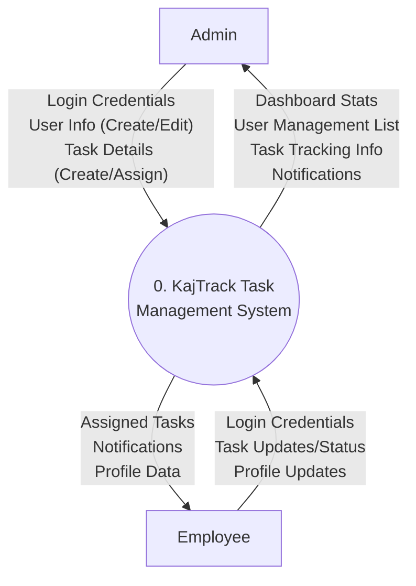
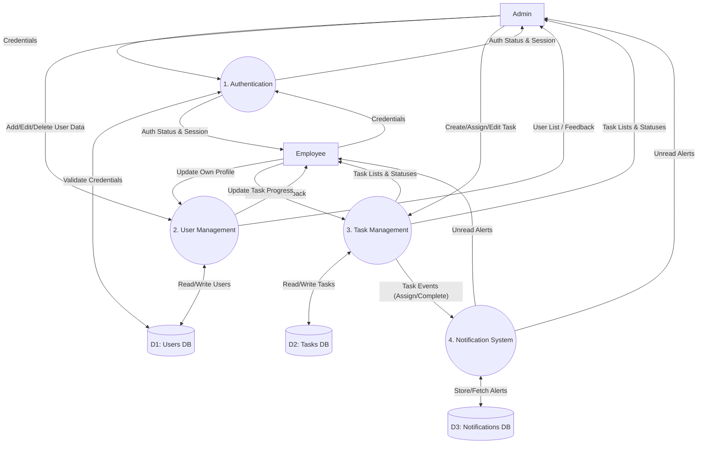
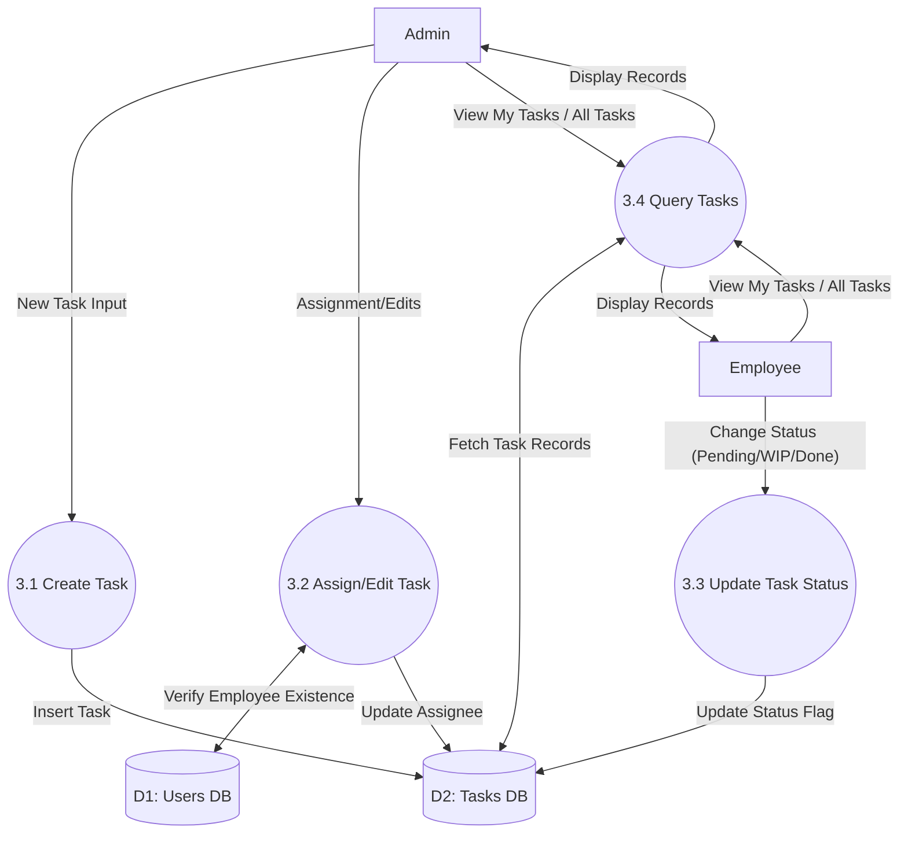

# Data Flow Diagrams (DFD)

Data Flow Diagrams illustrate how data is processed by the KajTrack system in terms of inputs and outputs. They visualize where data comes from, where it goes, and how it gets stored.

## 1. Level 0 DFD (Context Diagram)

The Context Diagram shows the KajTrack system as a single high-level process and illustrates its interactions with external entities (Admin and Employee).

---

## 2. Level 1 DFD (General System Flow)

The Level 1 DFD breaks down the main system into major sub-processes (Authentication, User Management, Task Management, Notifications) and introduces the Data Stores.

---

## 3. Level 2 DFD (Task Management Details)

This Level 2 DFD zooms into the **Task Management** process to show the specific data flow between task creation, assignment, progression, and querying.

