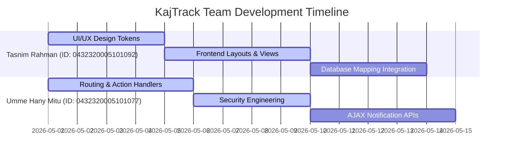
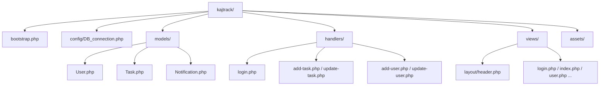

# 🏛️ University of Information Technology and Sciences
## 💻 Department of Computer Science and Engineering

# Software Engineering and System Analysis Lab Project Proposal

---

| Attribute | Details |
| :--- | :--- |
| **Course Code** | CSE 356 |
| **Course Name** | Software Engineering and System Analysis |
| **Section** | 6B |
| **Semester** | Spring 2026 |
| **Document Type**| Lab Project Proposal |

---

### 👥 Submitted By
- **Name**: Umme Hany Mitu
  - **ID**: `0432320005101077`
- **Name**: Tasnim Rahman
  - **ID**: `0432320005101092`

### 🎓 Submitted To
- **Dhrubo Barua** | Course Instructor
- **Md. Faysal** | Course Instructor

---

## Table of Contents
1. [Project Title](#1-project-title)
2. [Introduction](#2-introduction)
3. [Problem Statement](#3-problem-statement)
4. [Scope of the Project](#4-scope-of-the-project)
5. [Team Role Assignment](#5-team-role-assignment)
6. [Proposed System Architecture](#6-proposed-system-architecture)
7. [Key Features](#7-key-features)
8. [Technology Stack](#8-technology-stack)
9. [Methodology](#9-methodology)
10. [Estimated Cost](#10-estimated-cost)
11. [SWOT Analysis](#11-swot-analysis)
12. [Expected Outcome](#12-expected-outcome)
13. [Conclusion](#13-conclusion)
14. [References](#14-references)

---

## 1. Project Title
### **KajTrack — Role-Based Task Management System**

KajTrack is a modern, modular role-based task management web application built on a clean PHP MVC architecture. It features a fully database-agnostic design with zero-config SQLite/MySQL support, structured headless event routing, and a modern, liquid-glass visual aesthetic powered by the professional **Outfit** font.

---

## 2. Introduction
In modern software engineering organizations, the lifecycle of a task—from creation and allocation to status update and completion—is a fundamental element that directly impacts team velocity and deliverables. However, many small-to-medium organizations struggle with administrative overhead due to a lack of centralized task coordination systems. 

This project proposal introduces **KajTrack**, an elegant solution designed as part of the **CSE 356 (Software Engineering and System Analysis)** curriculum. KajTrack bridges the gap between administrators and employees by providing a role-based tracking ecosystem. Developed using structured native PHP, it balances professional system modularity with portable, zero-configuration local databases.

---

## 3. Problem Statement
Many development teams and operational units rely on fragmented communication channels—such as shared spreadsheets, email updates, and instant messengers—to assign and track task progress. This legacy workflow introduces several critical bottlenecks:
* **Information Fragmentation**: Task descriptions, attachments, and deadlines are scattered across different threads.
* **Lack of Accountability**: Without role-based system audits, task statuses can be modified or overwritten unauthorizedly, leading to confusion.
* **Notification Latency**: Employees are rarely alerted in real-time when a task is updated or newly assigned, leading to delayed project starts.
* **High Deployment Friction**: Conventional enterprise management tools are heavily coupled to external relational databases (e.g. centralized MySQL/PostgreSQL clusters), making local developer setup, offline work, and sandbox testing tedious and slow.

---

## 4. Scope of the Project
The scope of KajTrack is designed to satisfy the functional requirements of two primary user personas:

### 👑 Administrator Scope
- **User Administration**: Create, modify, and delete employee users securely.
- **Task Assignment & Allocation**: Create, modify, and delete tasks. Assign individual deadlines and prioritize lists.
- **Global Analytical Overview**: Access aggregate counters representing Total Tasks, Employees, and critical indicators like *Due Today* and *Overdue* metrics.

### 👤 Employee Scope
- **Backlog Management**: View a dedicated list of assigned tasks.
- **Progress Tracking**: Update status stages (*Pending*, *In Progress*, *Completed*) of their assigned work.
- **Real-Time Notification Badge Drawer**: View instant unread alerts for newly assigned work.
- **Self Profile Management**: Modify full name, update avatars, and securely reset passwords via current verification matching.

---

## 5. Team Role Assignment

To execute this project with software engineering rigor, tasks and roles are allocated between team members as follows:



### 🎨 Tasnim Rahman (ID: `0432320005101092`)
* **Role**: Frontend Lead & UI/UX Designer
* **Responsibilities**:
  * Designed the core visual identity, HSL color tokens, typography matching (*Outfit* Google Font), and liquid-glass CSS card states.
  * Developed the responsive navigation sidebar, dynamic header drawers, and layout templates (`views/layout/header.php`, `views/layout/footer.php`).
  * Integrated database entity bindings in view files.

### ⚙️ Umme Hany Mitu (ID: `0432320005101077`)
* **Role**: Backend Architect & Security Engineer
* **Responsibilities**:
  * Developed the central `bootstrap.php` controller, and designed all headless endpoints under `/handlers/` (POST handlers, redirection structures).
  * Implemented secure Bcrypt password hashing (`password_hash`/`password_verify`) and PDO prepared statement bindings.
  * Created the asynchronous AJAX notifications count API (`handlers/notification-count.php` and `handlers/notification.php`).

---

## 6. Proposed System Architecture

KajTrack uses a modern, modular MVC-inspired **Model-View-Handler** structure to maintain clean separation of concerns:



- **Views Layer**: Decoupled visual templates located in `/views/`. They call data extraction functions defined in `/models/` without compiling database connections inside UI threads.
- **Models Layer**: Reusable data access procedural modules inside `/models/` returning parameterized result sets.
- **Handlers Layer**: Headless form submit and REST/AJAX action listeners executing under `/handlers/` that process requests and route clients.

---

## 7. Key Features

1. **Role-Based Access Control (RBAC)**: Secure separation between administrative actions and employee status updates.
2. **Zero-Config Portable Fallback**: Dynamic connection manager which automatically spins up SQLite sandboxes with seeded data if MySQL is offline.
3. **Asynchronous Alerts Badge**: jQuery AJAX listeners that pull new notifications from the server every 5 seconds and animate DOM metrics in the background.
4. **Fluid Liquid-Glass Visuals**: Styled with modern CSS variables, transitions, Outfit font interfaces, and high-contrast alert modals.
5. **Robust Date Operations**: Parameter-bound dynamic calendar logic that solves dialect query conflicts (e.g. `CURDATE()` issues).

---

## 8. Technology Stack

* **Backend Environment**: PHP 8.x
* **Database Drivers**: MySQL / MariaDB (Production), SQLite (Local Fallback sandbox) via **PDO**
* **Frontend Layout**: HTML5, Vanilla CSS Modern Variables, Bootstrap 5.3 CDN
* **Icons & Fonts**: Font Awesome 6.x, Outfit Google Font Family
* **Dynamic Scripting**: jQuery (Google CDN)

---

## 9. Methodology

The team adopted the **Agile Scrum** framework to iterate rapidly on functional deliverables:

```
[Product Backlog] ──► [Sprint Planning] ──► [Daily Standups] ──► [Sprint Review & Retro]
        ▲                                                                │
        └─────────────────────────── [Deploy to Sandbox] ◄───────────────┘
```

1. **Sprint Planning**: Divided the product backlog into modular tasks (Layouts, Models, Handlers, Testing).
2. **Weekly Sprints**: Worked on concurrent components using Git branching logic.
3. **Integration & Review**: Deployed code to the local PHP server and ran automated test routines to verify user authentication, date operations, and alert counters.

---

## 10. Estimated Cost

Since the project uses a fully open-source technology stack, the licensing fees are **zero**. The primary cost breakdown represents development labor and optional hosting metrics:

| Cost Item | Description | Cost (BDT) |
| :--- | :--- | :---: |
| **Development Labor** | Engineering and UI design hours | *Academic Project (No Charge)* |
| **Database Licensing** | SQLite and MySQL Community Edition | 0 BDT (Open Source) |
| **Server Hosting** | Optional Cloud deployment (e.g. Heroku / AWS EC2) | 1,200 BDT / month (Optional) |
| **Domain Registration** | Custom `.org` or `.com` domain name | 1,500 BDT / year (Optional) |
| **Total Startup Cost** | **Basic local environment setup** | **0 BDT** |

---

## 11. SWOT Analysis

```
 ┌───────────────────────────────────────┬───────────────────────────────────────┐
 │               STRENGTHS               │              WEAKNESSES               │
 ├───────────────────────────────────────┼───────────────────────────────────────┤
 │ - Database-agnostic zero-config SQLite│ - Session-based authentication lacks  │
 │ - Clean modular MVC-inspired division │   stateless API options               │
 │ - Micro-animated liquid-glass layouts │ - Lack of dynamic Gantt diagrams      │
 ├───────────────────────────────────────┼───────────────────────────────────────┤
 │             OPPORTUNITIES             │                THREATS                │
 ├───────────────────────────────────────┼───────────────────────────────────────┤
 │ - Easily scalable to cloud SaaS platforms│ - Potential dependency injection updates│
 │ - Easily pluggable to Slack/Discord APIs│ - Concurrent SQLite file locks under  │
 │                                       │   highly concurrent user pools        │
 └───────────────────────────────────────┴───────────────────────────────────────┘
```

---

## 12. Expected Outcome

Upon full implementation of KajTrack, UITS and potential organizational adopters can expect:
* **0-Second Setup Time**: Developers can run `php -S 127.0.0.1:8000` and immediately test the app via the self-seeding SQLite database.
* **100% Task Transparency**: Real-time visual tracking eliminates lost assignments.
* **Sub-5-Second Notification Delivery**: Asynchronous API badges ensure immediate task awareness.
* **Zero SQL Injection Risk**: Pure parameter-bound PDO structures keep all employee data highly secure.

---

## 13. Conclusion

KajTrack successfully demonstrates how a structured backend approach, robust security precautions, and modern design aesthetics can transform standard task tracking. Designed as an academic software engineering entry, it addresses legacy organizational friction and showcases a highly portable system architecture that is ready for both local sandbox experimentation and large-scale cloud operations.

---

## 14. References

1. **PHP Documentation**: Official manual for session parameters, database connections, and BCrypt security (`https://www.php.net/manual/`).
2. **SQLite official home**: Documentation on portable relational engines and SQLite PDO operations (`https://sqlite.org/index.html`).
3. **Software Engineering & System Analysis Principles**: Roger S. Pressman, *Software Engineering: A Practitioner's Approach*.
4. **Bootstrap documentation**: Responsive frameworks and visual component designs (`https://getbootstrap.com/`).
